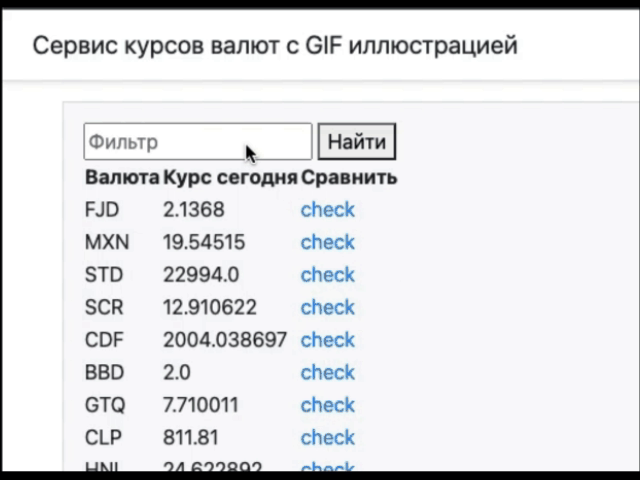
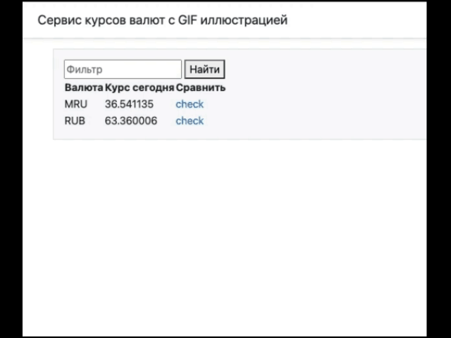
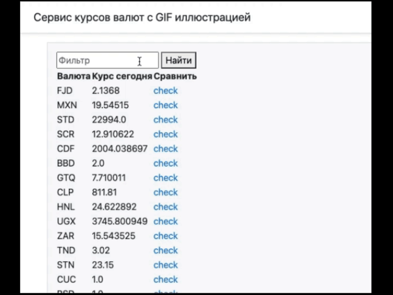

<h1 align="center">ExchangeRate</h1>


Данный репозиторий содержит в себе сервис курса валют, взаимодействующий с API (https://openexchangerates.org/api), и возвращающий gif через API (https://api.giphy.com) в зависимости от соотношения курса в разные дни в ответ.

## Описание функционала

Из функциональных возможностей наличие поля фильтрации для отбора валюты.
Фильтрация по вхождению символов в короткое название валюты:
<p align="center">
</p>

Работы фильтра по методам toUpperCase и toLowerCase:
<p align="center">
</p>
Кнопка "check" для сравнения текущего курса выбранной вылюты с предыдущим рабочим днём. Результат сравнения выводит на экран рандомный gif из ресурса "giphy.com" c тегом "rich" или "broke" в зависимости от результата сравнения:

<p align="center">

</p>

## Включает в себя

Spring Boot 2, Gradle, Java, API (Feign), Thymeleaf.

## Docker

Репозиторий так же доступен в Docker: https://hub.docker.com/r/permishin/exchangerate

## Установка

Репозиторий: https://github.com/permishin/exchangerate.git
Выполнить компнды
```
- clean
- build
```
## Донат
Донат приветствуется :beers: